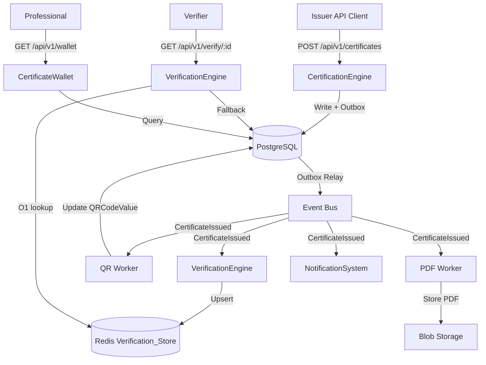
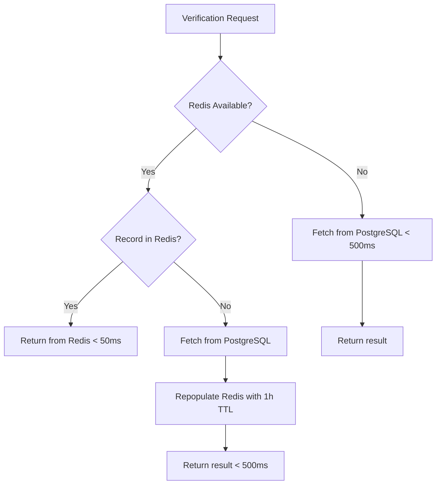

# Design Document: Certiva Core Platform

## Overview

Certiva is a national-grade trust registry for workforce credentials. This design covers the Phase 1 Digital Certification & Verification Infrastructure — a modular monolith built on .NET 8, PostgreSQL, Redis, and an event bus. The system enables Training Providers to issue tamper-evident digital certificates, Professionals to own and share credentials, Employers to verify workers in real time, and Platform Admins to govern system integrity.

The guiding principle is: **every certificate must be verifiable even if the system is partially down.** This drives the dual-store architecture (Redis for O(1) lookups, PostgreSQL as the authoritative fallback), the transactional outbox pattern for reliable event delivery, and the append-only certificate hash chain for tamper evidence.


## Architecture

### Modular Monolith Structure

The platform is organized as a modular monolith — a single deployable unit with strong internal module boundaries enforced by .NET project references and access modifiers. Each module owns its data, exposes a public API surface, and communicates with other modules only through well-defined interfaces or the internal event bus.

```
Certiva.Api                    ← ASP.NET Core host, routing, middleware
├── Certiva.IdentityRegistry   ← Professional registration, Issuer onboarding, Auth/RBAC
├── Certiva.CertificationEngine← Certificate issuance, lifecycle, QR, PDF, hash chain
├── Certiva.VerificationEngine ← Public verification, Verification_Store, consistency
├── Certiva.CertificateWallet  ← Worker-facing wallet, PDF download, sharing
├── Certiva.IssuerPortal       ← Template management, bulk issuance, analytics
├── Certiva.NotificationSystem ← Email dispatch, expiry reminders, idempotency
├── Certiva.AuditLog           ← Append-only audit trail, cryptographic hashing
└── Certiva.Infrastructure     ← PostgreSQL, Redis, Event Bus, Outbox, shared utilities
```


### High-Level Data Flow




### Technology Stack

| Concern | Technology | Rationale |
|---|---|---|
| Runtime | .NET 8 | LTS, high performance, strong typing |
| Web Framework | ASP.NET Core 8 | Minimal API + Controller hybrid |
| ORM | Entity Framework Core 8 | Code-first migrations, LINQ queries |
| Primary DB | PostgreSQL 16 | ACID transactions, JSONB, row-level locking |
| Cache / Verification Store | Redis 7 | O(1) key lookups, TTL support, pub/sub |
| Event Bus | MassTransit + RabbitMQ (or Azure Service Bus) | Reliable messaging, retry policies, dead-letter |
| PDF Generation | QuestPDF | Pure .NET, no native dependencies |
| QR Code | QRCoder | Pure .NET, PNG output |
| Auth | ASP.NET Core Identity + JWT Bearer | Industry standard, RBAC claims |
| MFA | TOTP via RFC 6238 (e.g., Otp.NET) | Standard TOTP, ±30s window |
| Observability | OpenTelemetry + Serilog + Prometheus | Structured logs, traces, metrics |
| Container | Docker + Kubernetes | Cloud-native deployment |
| Blob Storage | MinIO / Azure Blob Storage | PDF file storage |


---

## Components and Interfaces

### 1. Identity Registry Module

Responsibilities: Professional registration, Issuer onboarding, authentication, JWT issuance, RBAC, MFA.

**Key Interfaces:**

```csharp
public interface IIdentityRegistryService
{
    Task<RegisterProfessionalResult> RegisterProfessionalAsync(RegisterProfessionalCommand cmd, CancellationToken ct);
    Task<Professional> GetProfessionalByIdAsync(ProfessionalId id, TenantId tenantId, CancellationToken ct);
    Task<OnboardIssuerResult> OnboardIssuerAsync(OnboardIssuerCommand cmd, CancellationToken ct);
    Task<ApproveIssuerResult> ApproveIssuerAsync(IssuerId id, ActorId adminId, CancellationToken ct);
    Task<RejectIssuerResult> RejectIssuerAsync(IssuerId id, ActorId adminId, string reason, CancellationToken ct);
}

public interface IAuthService
{
    Task<AuthResult> AuthenticateAsync(LoginCommand cmd, CancellationToken ct);
    Task<TokenPair> RefreshTokenAsync(string refreshToken, CancellationToken ct);
    Task RevokeSessionAsync(string refreshToken, CancellationToken ct);
}

public interface INationalIdMaskingService
{
    string Mask(string nationalId);
}
```


**NationalId Masking Rule:**
- If `nationalId.Length <= 4`: return `new string('*', nationalId.Length)`
- Otherwise: return `new string('*', nationalId.Length - 4) + nationalId[^4..]`
- Applied in a dedicated `INationalIdMaskingService` called by every response mapper that includes Professional data.

**RBAC Roles:**

| Role | Permissions |
|---|---|
| Admin | All operations; Issuer approval/rejection; Audit log access |
| Issuer | Certificate issuance/revocation; Template management; Analytics (own data) |
| Worker | Certificate Wallet access; PDF download |
| Verifier | Public verification endpoint (no auth required) |


### 2. Certification Engine Module

Responsibilities: Certificate issuance (individual and bulk), lifecycle management (revocation, expiry), QR code generation, PDF generation, certificate hash chain, idempotency.

**Key Interfaces:**

```csharp
public interface ICertificationEngineService
{
    Task<IssueCertificateResult> IssueCertificateAsync(IssueCertificateCommand cmd, CancellationToken ct);
    Task<RevokeCertificateResult> RevokeCertificateAsync(RevokeCertificateCommand cmd, CancellationToken ct);
    Task<BulkIssueJobResult> EnqueueBulkIssueAsync(BulkIssueCommand cmd, CancellationToken ct);
    Task<BulkJobStatus> GetBulkJobStatusAsync(BulkJobId jobId, CancellationToken ct);
    Task<HashVerificationResult> VerifyCertificateHashAsync(CertificateId id, TenantId tenantId, CancellationToken ct);
}

public interface ICertificateHashService
{
    string ComputeHash(CertificateFields fields, string previousHash);
    string GetGenesisHash();
    bool VerifyChain(IReadOnlyList<Certificate> chain);
}

public interface ICanonicalSerializationService
{
    string Serialize(CertificateFields fields);
}
```


**Certificate Hash Chain Design:**

The hash chain is an append-only linked structure per Professional per Tenant:

1. For the first certificate: `hash = SHA256(Canonical(fields) + "0000...0000")` (64 hex zeros)
2. For subsequent certificates: `hash = SHA256(Canonical(fields) + previousCertificateHash)`
3. Canonical serialization: alphabetically ordered JSON keys, no whitespace, UTF-8 encoded
4. Fields included in canonical serialization: `certificateId`, `expiryDate`, `issuerId`, `issuerName`, `issueDate`, `name`, `professionalId`, `tenantId`

**Transactional Outbox Pattern:**

All domain events are written to an `OutboxMessages` table within the same database transaction as the business operation. A background `OutboxRelayWorker` polls for unpublished messages and publishes them to the Event Bus, marking them as published on success.

```
BEGIN TRANSACTION
  INSERT INTO Certificates (...)
  INSERT INTO OutboxMessages (EventType, Payload, CreatedAt, Published=false)
COMMIT

-- Background worker:
SELECT * FROM OutboxMessages WHERE Published = false ORDER BY CreatedAt
FOR EACH message: publish to Event Bus, UPDATE Published = true
```


### 3. Verification Engine Module

Responsibilities: Public certificate verification, Verification_Store management, consistency with PostgreSQL, VerificationLog recording, rate limiting.

**Key Interfaces:**

```csharp
public interface IVerificationEngineService
{
    Task<VerificationResult> VerifyCertificateAsync(CertificateId id, TenantId tenantId, string requestingIp, CancellationToken ct);
    Task ResynchronizeVerificationStoreAsync(CancellationToken ct);
}

public interface IVerificationStoreRepository
{
    Task<CertificateVerificationView?> GetAsync(CertificateId id, TenantId tenantId, CancellationToken ct);
    Task UpsertAsync(CertificateVerificationView view, CancellationToken ct);
    Task<bool> IsAvailableAsync(CancellationToken ct);
}
```

**Verification Resolution Flow:**



**Sequence Number Enforcement:**

Each `CertificateVerificationView` event carries a `SequenceNumber`. The Verification Engine maintains a `LastAppliedSequence` per `CertificateId`. Events are applied only if `event.SequenceNumber == lastApplied + 1`. Out-of-order events are discarded and recorded in the Audit Log.


### 4. Certificate Wallet Module

Responsibilities: Worker-facing certificate list, detail view, PDF download via signed URL, shareable link generation, expiry warning indicators.

**Key Interfaces:**

```csharp
public interface ICertificateWalletService
{
    Task<WalletCertificateList> GetCertificatesAsync(ProfessionalId professionalId, TenantId tenantId, CancellationToken ct);
    Task<WalletCertificateDetail> GetCertificateDetailAsync(CertificateId id, ProfessionalId professionalId, TenantId tenantId, CancellationToken ct);
    Task<SignedUrlResult> GetPdfDownloadUrlAsync(CertificateId id, ProfessionalId professionalId, TenantId tenantId, CancellationToken ct);
    Task<string> GetShareableLinkAsync(CertificateId id, ProfessionalId professionalId, TenantId tenantId, CancellationToken ct);
}
```

**Grouping and Sorting Logic:**

Certificates are returned grouped by `Status` in the order `[Active, Expired, Revoked]`, sorted by `IssueDate` descending within each group. The expiry warning indicator (`expiryWarning: true`) is set on any certificate where `ExpiryDate` is not null and `ExpiryDate <= today + 30 days`.

**Signed URL Generation:**

PDF download URLs are signed with a 15-minute expiry using HMAC-SHA256 over `{CertificateId}:{ExpiresAt}` with a server-side secret. The URL format is: `https://{domain}/api/v1/certificates/{id}/pdf?token={signedToken}&expires={timestamp}`.


### 5. Issuer Portal Module

Responsibilities: Certification template management, bulk issuance job management, analytics dashboard, Professional search.

**Key Interfaces:**

```csharp
public interface IIssuerPortalService
{
    Task<CreateTemplateResult> CreateTemplateAsync(CreateTemplateCommand cmd, CancellationToken ct);
    Task<UpdateTemplateResult> UpdateTemplateAsync(UpdateTemplateCommand cmd, CancellationToken ct);
    Task DeactivateTemplateAsync(TemplateId id, IssuerId issuerId, TenantId tenantId, CancellationToken ct);
    Task<IssuerAnalytics> GetAnalyticsAsync(IssuerId issuerId, TenantId tenantId, CancellationToken ct);
    Task<ProfessionalSearchResult> SearchProfessionalsAsync(ProfessionalSearchQuery query, IssuerId issuerId, TenantId tenantId, CancellationToken ct);
}
```

**Analytics Queries:**

- Certificate counts by Status: `SELECT Status, COUNT(*) FROM Certificates WHERE IssuerId = @id AND TenantId = @tid GROUP BY Status`
- Monthly issuance (trailing 12 months): `SELECT DATE_TRUNC('month', IssueDate) AS Month, COUNT(*) FROM Certificates WHERE IssuerId = @id AND TenantId = @tid AND IssueDate >= NOW() - INTERVAL '12 months' GROUP BY Month ORDER BY Month`
- All analytics queries include `AND TenantId = @tenantId AND IssuerId = @issuerId` to enforce data isolation.

### 6. Notification System Module

Responsibilities: Email dispatch for issuance alerts, revocation alerts, and expiry reminders; idempotency via derived keys; retry with exponential backoff.

**Key Interfaces:**

```csharp
public interface INotificationService
{
    Task DispatchIssuanceAlertAsync(CertificateIssuedEvent evt, CancellationToken ct);
    Task DispatchRevocationAlertAsync(CertificateRevokedEvent evt, CancellationToken ct);
    Task DispatchExpiryReminderAsync(ExpiryReminderJob job, CancellationToken ct);
}
```

**Idempotency Key Derivation:**

`idempotencyKey = SHA256(eventId + notificationType)` — stored in a `NotificationLog` table. Before dispatching, the system checks if a record with the same key already exists. If it does, the dispatch is skipped.


### 7. Audit Log Module

Responsibilities: Append-only audit trail, cryptographic hash per record, filtering, pagination, CSV export.

**Key Interfaces:**

```csharp
public interface IAuditLogService
{
    Task WriteAsync(AuditLogEntry entry, CancellationToken ct);
    Task<PagedResult<AuditLogEntry>> QueryAsync(AuditLogQuery query, CancellationToken ct);
    Task<Stream> ExportCsvAsync(AuditLogQuery query, CancellationToken ct);
}
```

**Record Hash Computation:**

Each `AuditLogEntry` has a `RecordHash` field computed at write time:
`recordHash = SHA256(actionType + entityId + timestamp.ToString("O") + actor + metadataJson)`

This hash is stored alongside the record. Any modification to the stored fields will produce a different hash on recomputation, making tampering detectable.

**Append-Only Enforcement:**

- No `UPDATE` or `DELETE` SQL is ever issued against the `AuditLogs` table.
- EF Core entity configuration sets the entity as insert-only (no update/delete operations).
- Database-level: a `RULE` or trigger can be added to reject `UPDATE`/`DELETE` on the table as a defense-in-depth measure.


### 8. API Layer

**Versioning Strategy:**

All endpoints are prefixed with `/api/v{major}`. Phase 1 uses `/api/v1/`. Version routing is handled by `Asp.Versioning` NuGet package. Deprecated versions include `Deprecation` and `Sunset` response headers. Removed versions return HTTP 410.

**Key Endpoint Groups:**

| Prefix | Module | Auth Required |
|---|---|---|
| `/api/v1/professionals` | IdentityRegistry | Issuer |
| `/api/v1/issuers` | IdentityRegistry | Admin |
| `/api/v1/auth` | IdentityRegistry | None |
| `/api/v1/certificates` | CertificationEngine | Issuer |
| `/api/v1/certificates/bulk` | IssuerPortal | Issuer |
| `/api/v1/verify/{id}` | VerificationEngine | None (public) |
| `/api/v1/wallet` | CertificateWallet | Worker |
| `/api/v1/templates` | IssuerPortal | Issuer |
| `/api/v1/analytics` | IssuerPortal | Issuer |
| `/api/v1/audit` | AuditLog | Admin |
| `/api/versions` | System | None |
| `/health/live` | System | None |
| `/health/ready` | System | None |
| `/metrics` | System | None (internal) |

**Multi-Tenancy Middleware:**

A `TenantResolutionMiddleware` runs early in the pipeline. It resolves `TenantId` from the authenticated JWT claims (`tenant_id` claim). If the claim is absent or unrecognized, the middleware short-circuits with HTTP 400. All downstream services receive `TenantId` as a required parameter.


---

## Data Models

### PostgreSQL Schema

```sql
-- Professionals
CREATE TABLE Professionals (
    ProfessionalId UUID PRIMARY KEY DEFAULT gen_random_uuid(),
    TenantId UUID NOT NULL,
    Name VARCHAR(100) NOT NULL,
    NationalId_Encrypted BYTEA NOT NULL,   -- AES-256 encrypted
    NationalId_Hash VARCHAR(64) NOT NULL,  -- SHA-256 for dedup lookup
    Phone_Encrypted BYTEA,
    Email_Encrypted BYTEA,
    CreatedAt TIMESTAMPTZ NOT NULL DEFAULT NOW(),
    CONSTRAINT uq_professional_nationalid_tenant UNIQUE (NationalId_Hash, TenantId)
);
CREATE INDEX idx_professionals_tenant ON Professionals (TenantId);

-- Issuers
CREATE TABLE Issuers (
    IssuerId UUID PRIMARY KEY DEFAULT gen_random_uuid(),
    TenantId UUID NOT NULL,
    OrganizationName VARCHAR(200) NOT NULL,
    Type VARCHAR(50) NOT NULL,
    VerificationStatus VARCHAR(20) NOT NULL DEFAULT 'Pending',
    CreatedAt TIMESTAMPTZ NOT NULL DEFAULT NOW(),
    CONSTRAINT uq_issuer_name_tenant UNIQUE (LOWER(OrganizationName), TenantId)
);
```


```sql
-- CertificateTemplates
CREATE TABLE CertificateTemplates (
    TemplateId UUID PRIMARY KEY DEFAULT gen_random_uuid(),
    TenantId UUID NOT NULL,
    IssuerId UUID NOT NULL REFERENCES Issuers(IssuerId),
    Name VARCHAR(100) NOT NULL,
    Description VARCHAR(500),
    ValidityPeriodDays INT NOT NULL CHECK (ValidityPeriodDays >= 0),
    IsActive BOOLEAN NOT NULL DEFAULT TRUE,
    CreatedAt TIMESTAMPTZ NOT NULL DEFAULT NOW(),
    UpdatedAt TIMESTAMPTZ NOT NULL DEFAULT NOW(),
    CONSTRAINT uq_template_name_issuer UNIQUE (LOWER(Name), IssuerId, TenantId)
);

-- Certificates
CREATE TABLE Certificates (
    CertificateId UUID PRIMARY KEY DEFAULT gen_random_uuid(),
    TenantId UUID NOT NULL,
    ProfessionalId UUID NOT NULL REFERENCES Professionals(ProfessionalId),
    IssuerId UUID NOT NULL REFERENCES Issuers(IssuerId),
    TemplateId UUID NOT NULL REFERENCES CertificateTemplates(TemplateId),
    Name VARCHAR(200) NOT NULL,
    Status VARCHAR(20) NOT NULL DEFAULT 'Active',
    IssueDate DATE NOT NULL,
    ExpiryDate DATE NULL,
    CertificateHash VARCHAR(64) NOT NULL,
    QRCodeUrl VARCHAR(500),
    QRCodeBase64 TEXT,
    PdfStoragePath VARCHAR(500),
    RevocationReason VARCHAR(500),
    RevokedAt TIMESTAMPTZ,
    CreatedAt TIMESTAMPTZ NOT NULL DEFAULT NOW(),
    UpdatedAt TIMESTAMPTZ NOT NULL DEFAULT NOW(),
    CONSTRAINT uq_active_cert_professional_template UNIQUE (ProfessionalId, TemplateId, TenantId, Status)
        DEFERRABLE INITIALLY DEFERRED
);
CREATE INDEX idx_certificates_tenant ON Certificates (TenantId);
CREATE INDEX idx_certificates_professional ON Certificates (ProfessionalId, TenantId);
CREATE INDEX idx_certificates_issuer ON Certificates (IssuerId, TenantId);
CREATE INDEX idx_certificates_expiry ON Certificates (ExpiryDate, Status) WHERE ExpiryDate IS NOT NULL;
```


```sql
-- OutboxMessages (Transactional Outbox)
CREATE TABLE OutboxMessages (
    MessageId UUID PRIMARY KEY DEFAULT gen_random_uuid(),
    TenantId UUID NOT NULL,
    EventType VARCHAR(100) NOT NULL,
    Payload JSONB NOT NULL,
    CreatedAt TIMESTAMPTZ NOT NULL DEFAULT NOW(),
    PublishedAt TIMESTAMPTZ,
    Published BOOLEAN NOT NULL DEFAULT FALSE
);
CREATE INDEX idx_outbox_unpublished ON OutboxMessages (Published, CreatedAt) WHERE Published = FALSE;

-- IdempotencyKeys
CREATE TABLE IdempotencyKeys (
    IdempotencyKey VARCHAR(256) PRIMARY KEY,
    TenantId UUID NOT NULL,
    OperationType VARCHAR(100) NOT NULL,
    ResultPayload JSONB NOT NULL,
    CreatedAt TIMESTAMPTZ NOT NULL DEFAULT NOW(),
    ExpiresAt TIMESTAMPTZ NOT NULL
);
CREATE INDEX idx_idempotency_expiry ON IdempotencyKeys (ExpiresAt);

-- BulkIssueJobs
CREATE TABLE BulkIssueJobs (
    JobId UUID PRIMARY KEY DEFAULT gen_random_uuid(),
    TenantId UUID NOT NULL,
    IssuerId UUID NOT NULL,
    TemplateId UUID NOT NULL,
    Status VARCHAR(20) NOT NULL DEFAULT 'Queued',
    TotalCount INT NOT NULL,
    ProcessedCount INT NOT NULL DEFAULT 0,
    SuccessCount INT NOT NULL DEFAULT 0,
    FailureCount INT NOT NULL DEFAULT 0,
    ResultReport JSONB,
    SubmittedAt TIMESTAMPTZ NOT NULL DEFAULT NOW(),
    CompletedAt TIMESTAMPTZ
);
```


```sql
-- VerificationLogs
CREATE TABLE VerificationLogs (
    LogId UUID PRIMARY KEY DEFAULT gen_random_uuid(),
    TenantId UUID NOT NULL,
    CertificateId UUID NOT NULL,
    RequestingIp VARCHAR(45) NOT NULL,
    StatusReturned VARCHAR(20) NOT NULL,
    Timestamp TIMESTAMPTZ NOT NULL DEFAULT NOW()
);
CREATE INDEX idx_verificationlogs_cert ON VerificationLogs (CertificateId, TenantId);

-- AuditLogs
CREATE TABLE AuditLogs (
    AuditId UUID PRIMARY KEY DEFAULT gen_random_uuid(),
    TenantId UUID NOT NULL,
    ActionType VARCHAR(100) NOT NULL,
    EntityId VARCHAR(200) NOT NULL,
    Actor VARCHAR(200) NOT NULL,
    Timestamp TIMESTAMPTZ NOT NULL DEFAULT NOW(),
    Metadata JSONB,
    RecordHash VARCHAR(64) NOT NULL
);
CREATE INDEX idx_auditlogs_tenant ON AuditLogs (TenantId, Timestamp DESC);
CREATE INDEX idx_auditlogs_action ON AuditLogs (ActionType, TenantId);
CREATE INDEX idx_auditlogs_entity ON AuditLogs (EntityId, TenantId);

-- NotificationLogs
CREATE TABLE NotificationLogs (
    NotificationId UUID PRIMARY KEY DEFAULT gen_random_uuid(),
    TenantId UUID NOT NULL,
    ProfessionalId UUID NOT NULL,
    IdempotencyKey VARCHAR(64) NOT NULL UNIQUE,
    NotificationType VARCHAR(50) NOT NULL,
    EventId VARCHAR(200) NOT NULL,
    Status VARCHAR(20) NOT NULL,
    DispatchedAt TIMESTAMPTZ,
    FailedAt TIMESTAMPTZ,
    CreatedAt TIMESTAMPTZ NOT NULL DEFAULT NOW()
);
```


### Redis Data Structures

**CertificateVerificationView:**
- Key: `cert:verify:{tenantId}:{certificateId}`
- Value: JSON-serialized `CertificateVerificationView`
- TTL: 1 hour (reset on every write/update)

```json
{
  "certificateId": "...",
  "tenantId": "...",
  "status": "Active",
  "expiryDate": "2025-12-31",
  "professionalName": "John Doe",
  "issuerName": "Acme Training Ltd",
  "qrCodeUrl": "https://certiva.io/verify/..."
}
```

**Rate Limiting (Auth endpoint):**
- Key: `ratelimit:auth:{ip}`
- Value: counter (INCR)
- TTL: 15 minutes (sliding window)

**Rate Limiting (Public verification):**
- Key: `ratelimit:verify:{ip}`
- Value: counter (INCR)
- TTL: 1 minute

**Sequence Tracking:**
- Key: `seq:{tenantId}:{certificateId}`
- Value: last applied sequence number (integer)


### Domain Events

| Event | Publisher | Consumers |
|---|---|---|
| `ProfessionalRegistered` | IdentityRegistry | (future: onboarding workflows) |
| `IssuerApproved` | IdentityRegistry | NotificationSystem |
| `IssuerRejected` | IdentityRegistry | NotificationSystem |
| `CertificateIssued` | CertificationEngine | VerificationEngine, QrWorker, PdfWorker, NotificationSystem |
| `CertificateRevoked` | CertificationEngine | VerificationEngine, NotificationSystem |
| `CertificateExpired` | CertificationEngine (scheduler) | VerificationEngine, NotificationSystem |
| `QrCodeGenerated` | QrWorker | CertificationEngine (update record) |
| `PdfGenerated` | PdfWorker | CertificateWallet (availability signal) |
| `BulkIssueJobEnqueued` | IssuerPortal | CertificationEngine (bulk processor) |

All events carry: `EventId` (UUID), `TenantId`, `SequenceNumber`, `OccurredAt` (UTC timestamp), and event-specific payload.


---

## Correctness Properties

*A property is a characteristic or behavior that should hold true across all valid executions of a system — essentially, a formal statement about what the system should do. Properties serve as the bridge between human-readable specifications and machine-verifiable correctness guarantees.*

### Property 1: NationalId Masking Is Applied Universally

*For any* NationalId string of any length, the masking function SHALL replace all characters except the last four with asterisks; if the NationalId has four or fewer characters, all characters SHALL be replaced with asterisks. This property must hold for every API response that includes Professional data, regardless of endpoint.

**Validates: Requirements 1.7, 16.3**

---

### Property 2: Professional Registration Deduplication

*For any* NationalId and TenantId combination, registering the same NationalId twice within the same tenant SHALL return HTTP 409 on the second attempt and SHALL NOT create a second Professional record. The total count of Professional records for that NationalId+TenantId combination SHALL remain exactly one.

**Validates: Requirements 1.2**

---

### Property 3: Professional Registration Field Validation

*For any* registration request with at least one missing or invalid required field (Name absent/empty/over 100 chars, NationalId outside 6–20 alphanumeric chars, Phone not E.164, Email not RFC 5322, or both Phone and Email absent), the Identity_Registry SHALL return a validation error identifying every invalid field and SHALL NOT persist any Professional record.

**Validates: Requirements 1.3, 1.4, 1.5**

---

### Property 4: Unverified Issuer Cannot Issue or Manage Templates

*For any* Issuer whose VerificationStatus is Pending or Rejected, any certificate issuance request or template creation/update request from that Issuer SHALL be rejected with HTTP 403, regardless of the certificate or template content.

**Validates: Requirements 2.4, 3.5**

---

### Property 5: Issuer Organization Name Uniqueness (Case-Insensitive)

*For any* two Issuer onboarding requests within the same TenantId where the OrganizationNames are equal under case-insensitive comparison, the second request SHALL return HTTP 409 and SHALL NOT create a duplicate Issuer record.

**Validates: Requirements 2.5, 2.6**

---

### Property 6: Issuer State Transition Idempotency

*For any* Issuer already in Verified status, a second approval request SHALL return HTTP 409 and SHALL NOT create a duplicate Audit_Log entry. *For any* Issuer already in Rejected status, a second rejection request SHALL return HTTP 409 and SHALL NOT create a duplicate Audit_Log entry.

**Validates: Requirements 2.7**

---

### Property 7: Template Required Field Validation

*For any* template creation request with a missing Name, negative ValidityPeriodDays, or absent IssuerId, the Issuer_Portal SHALL return a descriptive validation error identifying every invalid field and SHALL NOT persist any template record.

**Validates: Requirements 3.2**

---

### Property 8: Template Scoped to Creating Issuer

*For any* certification template, it SHALL only be selectable for issuance by the Issuer identified by the template's IssuerId. Requests from any other Issuer referencing that TemplateId SHALL be rejected with HTTP 403.

**Validates: Requirements 3.3, 4.8**

---

### Property 9: Template Updates Do Not Retroactively Alter Certificates

*For any* certificate issued before a template update, the certificate's Name, ExpiryDate, and all other fields SHALL remain unchanged after the template is updated. The update SHALL only affect issuance requests received after the update is persisted.

**Validates: Requirements 3.4**

---

### Property 10: Template Name Uniqueness Per Issuer (Case-Insensitive)

*For any* two template creation requests from the same Issuer within the same TenantId where the Names are equal under case-insensitive comparison, the second request SHALL return HTTP 409 and SHALL NOT persist a duplicate template record.

**Validates: Requirements 3.6**

---

### Property 11: Certificate Issuance Creates Correct Record

*For any* valid issuance request with a TemplateId where ValidityPeriodDays > 0, the created Certificate SHALL have ExpiryDate = IssueDate + ValidityPeriodDays. *For any* valid issuance request with ValidityPeriodDays = 0, the created Certificate SHALL have ExpiryDate = null. The Certificate SHALL contain a system-generated CertificateId, the correct ProfessionalId, IssuerId, TenantId, and Status of Active.

**Validates: Requirements 4.1**

---

### Property 12: Certificate Hash Chain Integrity

*For any* sequence of certificates issued to the same Professional within the same TenantId, recomputing each certificate's hash from its canonical serialization and the preceding certificate's stored hash (or the genesis value of 64 hex zeros for the first) SHALL produce a value equal to the stored CertificateHash. Modifying any field of any certificate in the chain SHALL cause all subsequent hashes to fail recomputation.

**Validates: Requirements 4.2, 19.1, 19.2, 19.4**

---

### Property 13: Canonical Serialization Determinism

*For any* set of certificate fields, serializing those fields using the canonical serialization function SHALL always produce the same byte sequence regardless of the order in which fields were set, the locale of the runtime, or the number of times the function is called. The round-trip `deserialize(serialize(fields)) == fields` SHALL hold for all valid certificate field sets.

**Validates: Requirements 19.2**

---

### Property 14: Issuance Idempotency

*For any* issuance request with an Idempotency_Key that matches a previously completed operation within the 24-hour TTL window, the Certification_Engine SHALL return the original certificate with HTTP 200 and SHALL NOT create a duplicate Certificate record. The total count of Certificate records for that Idempotency_Key SHALL remain exactly one.

**Validates: Requirements 4.5, 17.1**

---

### Property 15: Duplicate Active Certificate Prevention

*For any* combination of ProfessionalId, TemplateId, and TenantId where an Active certificate already exists, a new issuance request SHALL return HTTP 409 containing the existing CertificateId and SHALL NOT create a duplicate Certificate record.

**Validates: Requirements 4.10**

---

### Property 16: Bulk Issuance Boundary Validation

*For any* bulk issuance request with an empty ProfessionalId list or a list containing more than 1,000 entries, the Issuer_Portal SHALL return HTTP 422 and SHALL NOT enqueue the job. *For any* bulk issuance request with a list of 1 to 1,000 entries, the request SHALL be accepted and a job reference SHALL be returned.

**Validates: Requirements 5.2**

---

### Property 17: Bulk Issuance Partial Failure Isolation

*For any* bulk issuance job where some entries are invalid (NotFound, AlreadyIssued, ValidationError, or AuthorizationError), the Certification_Engine SHALL continue processing all remaining valid entries and SHALL NOT abort the batch. The result report SHALL contain the correct success count, failure count, and list of failed ProfessionalIds with failure categories.

**Validates: Requirements 5.7**

---

### Property 18: Bulk Issuance Applies Individual Idempotency Rules

*For any* bulk issuance job, each individual entry SHALL be processed with the same idempotency rules as individual issuance. Submitting the same bulk job twice (same Idempotency_Keys per entry) SHALL NOT create duplicate Certificate records.

**Validates: Requirements 5.5**

---

### Property 19: Soft Deletion Invariant

*For any* certificate that has been revoked, expired, or had any lifecycle operation applied to it, the Certificate record SHALL still exist in the PostgreSQL write model with its Status updated. No Certificate record SHALL ever be permanently deleted.

**Validates: Requirements 6.4**

---

### Property 20: Revocation State Transition Validation

*For any* certificate whose Status is already Revoked or Expired, a revocation request SHALL return HTTP 409 and SHALL NOT create a duplicate Audit_Log entry. *For any* revocation request without a revocation reason, the Certification_Engine SHALL return HTTP 422 and SHALL NOT process the revocation.

**Validates: Requirements 6.5, 6.10**

---

### Property 21: Cross-Issuer Revocation Authorization

*For any* revocation request where the requesting Issuer is not the original issuer of the certificate, the Certification_Engine SHALL return HTTP 403 and SHALL NOT update the certificate Status.

**Validates: Requirements 6.6**

---

### Property 22: QR Code URL Format and Uniqueness

*For any* certificate, the generated QR code SHALL encode a URL in the format `https://{domain}/verify/{CertificateId}`. *For any* two certificates within the same TenantId, their QR code URLs SHALL be distinct (since CertificateIds are globally unique UUIDs).

**Validates: Requirements 7.1, 7.3**

---

### Property 23: QR Code Image Minimum Resolution

*For any* generated QR code PNG image, the image dimensions SHALL be at least 200×200 pixels and the full verification URL SHALL be encodable without truncation.

**Validates: Requirements 7.7**

---

### Property 24: PDF Contains Required Fields

*For any* generated PDF certificate, the document SHALL contain the Professional's Name, certificate Name, IssueDate, ExpiryDate (or "Does not expire" if null), IssuerName, and an embedded QR code image. The PDF SHALL be associated with the correct CertificateId.

**Validates: Requirements 8.1**

---

### Property 25: PDF Download Authorization

*For any* PDF download request, only the Professional whose ProfessionalId matches the certificate's ProfessionalId SHALL be permitted to download the PDF. Any other authenticated user requesting the PDF SHALL receive HTTP 403.

**Validates: Requirements 8.4**

---

### Property 26: Signed URL Expiry

*For any* generated signed PDF download URL, the URL SHALL expire after exactly 15 minutes from generation. Requests made after the expiry time SHALL be rejected.

**Validates: Requirements 8.5**

---

### Property 27: Revoked and Expired Certificates Return valid=false

*For any* certificate whose Status is Revoked or Expired, the verification response SHALL contain `valid: false` and the current Status value. The response SHALL NOT contain `valid: true` for any certificate in these states.

**Validates: Requirements 9.7**

---

### Property 28: Non-Existent Certificate Verification Returns 404

*For any* verification request referencing a CertificateId that does not exist in the system, the Verification_Engine SHALL return HTTP 404 containing an error indicator and the queried CertificateId.

**Validates: Requirements 9.5**

---

### Property 29: Certificate Wallet Returns All Certificates Grouped and Sorted

*For any* authenticated Professional, the Certificate_Wallet SHALL return all certificates associated with their ProfessionalId, grouped by Status (Active, Expired, Revoked) and sorted by IssueDate descending within each group. No certificate belonging to a different ProfessionalId SHALL appear in the response.

**Validates: Requirements 11.1, 11.4**

---

### Property 30: Expiry Warning Indicator

*For any* certificate with an ExpiryDate that is not null and falls within 30 days inclusive of the current date, the Certificate_Wallet response SHALL include a distinct expiry warning indicator on that certificate. Certificates with ExpiryDate more than 30 days away or with null ExpiryDate SHALL NOT have the warning indicator set.

**Validates: Requirements 11.5**

---

### Property 31: Cross-Professional Wallet Access Authorization

*For any* authenticated Professional requesting a certificate by CertificateId that belongs to a different ProfessionalId, the Certificate_Wallet SHALL return HTTP 403.

**Validates: Requirements 11.6**

---

### Property 32: Shareable Link Format

*For any* certificate, the shareable link returned by the Certificate_Wallet SHALL match the format `https://{domain}/verify/{CertificateId}`, which is identical to the QR code verification URL.

**Validates: Requirements 11.3**

---

### Property 33: Notification Idempotency

*For any* combination of EventId and NotificationType, the Notification_System SHALL dispatch at most one notification. Duplicate events with the same EventId and NotificationType SHALL be detected via the derived Idempotency_Key and SHALL NOT result in a second dispatch.

**Validates: Requirements 12.8**

---

### Property 34: Analytics Data Isolation

*For any* analytics request from an authenticated Issuer, all returned data (certificate counts, monthly breakdowns, search results) SHALL be restricted exclusively to certificates issued by that Issuer within their TenantId. No data belonging to other Issuers or Tenants SHALL appear in the response.

**Validates: Requirements 13.4**

---

### Property 35: Analytics Counts Correctness

*For any* set of certificates issued by an Issuer, the analytics dashboard SHALL return counts that exactly match the actual distribution of certificates by Status. The monthly breakdown SHALL correctly aggregate certificates by calendar month for the trailing 12 months.

**Validates: Requirements 13.1, 13.2**

---

### Property 36: Professional Search Returns Matching Results

*For any* search query by Name (case-insensitive partial match) or NationalId (exact match), the Issuer_Portal SHALL return all and only the certificates issued by the requesting Issuer to Professionals matching the query criteria. No certificates from other Issuers SHALL be included.

**Validates: Requirements 13.3**

---

### Property 37: Audit Log Append-Only Invariant

*For any* Audit_Log record that has been written, no subsequent operation SHALL modify or delete that record. The total count of Audit_Log records SHALL be monotonically non-decreasing over time.

**Validates: Requirements 14.2**

---

### Property 38: Audit Log Record Hash Integrity

*For any* Audit_Log record, recomputing the hash from the stored fields (ActionType, EntityId, Timestamp, Actor, Metadata) SHALL produce a value equal to the stored RecordHash. Any modification to any stored field SHALL cause the recomputed hash to differ from the stored hash.

**Validates: Requirements 14.3**

---

### Property 39: Audit Log Records All Significant Actions

*For any* significant action (certificate issuance, revocation, expiry transition, verification lookup, Issuer approval, Issuer rejection), an Audit_Log entry SHALL be created containing ActionType, EntityId, Timestamp, Actor, TenantId, and a Metadata payload not exceeding 10 KB.

**Validates: Requirements 14.1**

---

### Property 40: Authentication Error Conditions

*For any* login request with invalid credentials, the Identity_Registry SHALL return HTTP 401 and SHALL NOT issue a JWT. *For any* request with an expired or invalid JWT, the Identity_Registry SHALL return HTTP 401. *For any* request with an invalid or expired refresh token, the Identity_Registry SHALL return HTTP 401 and SHALL invalidate all tokens for that session.

**Validates: Requirements 15.2, 15.4, 15.5**

---

### Property 41: RBAC Enforcement

*For any* user without the Admin role attempting to approve or reject an Issuer, the Identity_Registry SHALL return HTTP 403. *For any* user without the Issuer role attempting to issue or revoke a certificate, the Identity_Registry SHALL return HTTP 403. *For any* user without the Worker role attempting to access the Certificate_Wallet, the Identity_Registry SHALL return HTTP 403.

**Validates: Requirements 15.7, 15.8, 15.9**

---

### Property 42: Contact Details Masked in Verification Responses

*For any* public verification response, the response SHALL contain only the Professional's Name, CertificateId, IssueDate, and ExpiryDate. Full contact details (Phone, Email, NationalId) SHALL NOT appear in any verification response.

**Validates: Requirements 16.4**

---

### Property 43: Ordered Event Processing

*For any* sequence of state-change events for a given CertificateId, the Verification_Engine SHALL apply events only in sequence-number order. Any event whose sequence number is not exactly `lastApplied + 1` SHALL be discarded and recorded in the Audit_Log.

**Validates: Requirements 17.3**

---

### Property 44: Structured Log Fields for Certificate Operations

*For any* certificate issuance, revocation, or expiry transition, the emitted log entry SHALL be JSON-formatted and SHALL contain CertificateId, ProfessionalId, IssuerId, Timestamp, and operation type as named fields.

**Validates: Requirements 18.1**

---

### Property 45: Tampered Certificate Detection

*For any* certificate whose stored CertificateHash does not match the hash recomputed from its stored fields and the preceding certificate's hash, the Certification_Engine SHALL update the certificate's Status to Tampered and SHALL record a discrepancy entry in the Audit_Log containing the CertificateId, stored hash, recomputed hash, and detection timestamp.

**Validates: Requirements 19.5**

---

### Property 46: Multi-Tenant Data Isolation

*For any* query against a tenant-scoped table, the result SHALL contain only records where TenantId matches the authenticated actor's TenantId. Generating data for two different tenants and querying as one tenant SHALL never return records belonging to the other tenant.

**Validates: Requirements 21.2, 21.7**

---

### Property 47: Cross-Tenant Entity Validation

*For any* certificate issuance, revocation, or verification request where the ProfessionalId, IssuerId, or TemplateId belongs to a different TenantId than the authenticated actor, the Certification_Engine SHALL return HTTP 403.

**Validates: Requirements 21.3**

---

### Property 48: Missing or Invalid TenantId Handling

*For any* request received without a resolvable TenantId (missing or unrecognized tenant context), the system SHALL return HTTP 400 and SHALL NOT process the request. *For any* request with valid tenant context that attempts to access data belonging to a different TenantId, the system SHALL return HTTP 403.

**Validates: Requirements 21.6**

---

### Property 49: Deprecated API Version Headers

*For any* call to a deprecated API version, the response SHALL include a `Deprecation` header containing the deprecation date and a `Sunset` header containing the planned removal date.

**Validates: Requirements 22.3**

---

### Property 50: Removed API Version Returns 410

*For any* request to an API version that has been removed, the system SHALL return HTTP 410 Gone with a message indicating the version is no longer supported and referencing the current supported version.

**Validates: Requirements 22.5**


---

## Error Handling

### Error Response Format

All API errors follow a consistent JSON envelope:

```json
{
  "type": "https://certiva.io/errors/{error-code}",
  "title": "Human-readable error title",
  "status": 400,
  "detail": "Detailed description of what went wrong",
  "traceId": "00-abc123...",
  "errors": {
    "fieldName": ["Validation message 1", "Validation message 2"]
  }
}
```

### HTTP Status Code Conventions

| Scenario | Status Code |
|---|---|
| Successful creation | 201 Created |
| Successful read/update | 200 OK |
| Async operation accepted | 202 Accepted |
| Validation error | 422 Unprocessable Entity |
| Authentication failure | 401 Unauthorized |
| Authorization failure | 403 Forbidden |
| Resource not found | 404 Not Found |
| Conflict (duplicate, invalid state transition) | 409 Conflict |
| Rate limit exceeded | 429 Too Many Requests |
| Removed API version | 410 Gone |
| Server error | 500 Internal Server Error |


### Module-Specific Error Handling

**Identity Registry:**
- Duplicate NationalId: HTTP 409 with existing `ProfessionalId`
- Duplicate OrganizationName: HTTP 409 with existing `IssuerId`
- Invalid state transition (approve already-Verified): HTTP 409
- Validation failures: HTTP 422 with per-field error messages

**Certification Engine:**
- Non-existent ProfessionalId or TemplateId: HTTP 404
- Template belonging to different Issuer: HTTP 403
- Duplicate Active certificate: HTTP 409 with existing `CertificateId`
- Idempotency key match (in-progress): HTTP 202
- Idempotency key match (completed): HTTP 200 with original result
- Missing revocation reason: HTTP 422
- Cross-Issuer revocation: HTTP 403
- Revocation of already-Revoked/Expired: HTTP 409
- Hash mismatch detected: Status updated to Tampered, Audit_Log entry written

**Verification Engine:**
- Non-existent CertificateId: HTTP 404 + Audit_Log entry
- Rate limit exceeded: HTTP 429

**Certificate Wallet:**
- Cross-Professional access: HTTP 403
- PDF not yet generated: HTTP 202 with job state

**Audit Log:**
- Write failure: The originating action is rejected (HTTP 500 or appropriate error). For security events specifically, the request is always rejected on audit log write failure.

**Transactional Outbox Failures:**
- If the outbox write fails within the transaction, the entire transaction rolls back. The API returns an error. No partial state is committed.

**Background Worker Failures:**
- Retry with exponential backoff: base 1s, max 60s, up to 3 retries
- After exhausting retries: move to dead-letter queue, write Audit_Log entry
- PDF infrastructure errors: retry indefinitely (no dead-letter for infrastructure failures)


---

## Testing Strategy

### Dual Testing Approach

The platform uses a complementary combination of property-based tests and example-based unit/integration tests:

- **Property-based tests** validate universal correctness properties across a wide range of generated inputs. They catch edge cases that example-based tests miss.
- **Unit tests** validate specific examples, error conditions, and integration points between components.
- **Integration tests** validate infrastructure wiring, event flow, and external service behavior with 1–3 representative examples.
- **Smoke tests** validate deployment configuration and environment setup.

### Property-Based Testing

**Library:** [FsCheck](https://fscheck.github.io/FsCheck/) for .NET (or [CsCheck](https://github.com/AnthonyLloyd/CsCheck) as an alternative)

**Configuration:** Each property test runs a minimum of **100 iterations** with randomized inputs.

**Tag format:** Each property test is annotated with a comment:
`// Feature: certiva-core-platform, Property {N}: {property_text}`

**Properties to implement as property-based tests:**

| Property | Test Focus | Key Generators |
|---|---|---|
| P1: NationalId Masking | `INationalIdMaskingService.Mask()` | Random strings of varying length |
| P2: Registration Deduplication | `RegisterProfessionalAsync` | Random valid NationalIds |
| P3: Registration Validation | `RegisterProfessionalAsync` | Invalid field combinations |
| P4: Unverified Issuer Rejection | `IssueCertificateAsync` | Issuers in Pending/Rejected states |
| P5: Issuer Name Uniqueness | `OnboardIssuerAsync` | Names with varying case |
| P6: Issuer State Transition | `ApproveIssuerAsync`, `RejectIssuerAsync` | Already-transitioned issuers |
| P7: Template Validation | `CreateTemplateAsync` | Invalid template fields |
| P8: Template Issuer Scoping | `IssueCertificateAsync` | Cross-issuer template references |
| P9: Template Update Immutability | `UpdateTemplateAsync` + existing certs | Random template updates |
| P10: Template Name Uniqueness | `CreateTemplateAsync` | Names with varying case |
| P11: Certificate Issuance Fields | `IssueCertificateAsync` | Random ValidityPeriodDays values |
| P12: Hash Chain Integrity | `ICertificateHashService` | Random certificate sequences |
| P13: Canonical Serialization | `ICanonicalSerializationService` | Random certificate field sets |
| P14: Issuance Idempotency | `IssueCertificateAsync` | Same Idempotency_Key repeated |
| P15: Duplicate Active Prevention | `IssueCertificateAsync` | Same Professional+Template |
| P16: Bulk Boundary Validation | `EnqueueBulkIssueAsync` | Lists of 0, 1, 1000, 1001 entries |
| P17: Bulk Partial Failure | Bulk processor | Mixed valid/invalid entries |
| P18: Bulk Idempotency | Bulk processor | Repeated bulk jobs |
| P19: Soft Deletion | All lifecycle operations | Random certificates |
| P20: Revocation State Validation | `RevokeCertificateAsync` | Already-Revoked/Expired certs |
| P21: Cross-Issuer Revocation | `RevokeCertificateAsync` | Cross-issuer requests |
| P22: QR Code URL Format | QR generation service | Random CertificateIds |
| P23: QR Code Resolution | QR generation service | Random verification URLs |
| P24: PDF Required Fields | PDF generation service | Random certificate data |
| P25: PDF Download Auth | `GetPdfDownloadUrlAsync` | Cross-professional requests |
| P26: Signed URL Expiry | URL signing service | Random generation times |
| P27: Revoked/Expired valid=false | `VerifyCertificateAsync` | Revoked/Expired certificates |
| P28: Non-Existent Cert 404 | `VerifyCertificateAsync` | Random non-existent IDs |
| P29: Wallet Grouping/Sorting | `GetCertificatesAsync` | Random certificate sets |
| P30: Expiry Warning Indicator | `GetCertificatesAsync` | Certs near/far from expiry |
| P31: Cross-Professional Wallet Auth | `GetCertificateDetailAsync` | Cross-professional requests |
| P32: Shareable Link Format | `GetShareableLinkAsync` | Random CertificateIds |
| P33: Notification Idempotency | `INotificationService` | Duplicate events |
| P34: Analytics Data Isolation | `GetAnalyticsAsync` | Multi-issuer data sets |
| P35: Analytics Counts | `GetAnalyticsAsync` | Random certificate distributions |
| P36: Professional Search | `SearchProfessionalsAsync` | Random search queries |
| P37: Audit Log Append-Only | `IAuditLogService` | Attempted modifications |
| P38: Audit Log Hash Integrity | `IAuditLogService` | Random audit entries |
| P39: Audit Log Coverage | All significant actions | Random action sequences |
| P40: Auth Error Conditions | `IAuthService` | Invalid credentials/tokens |
| P41: RBAC Enforcement | All protected endpoints | Users with wrong roles |
| P42: Contact Details Masking | `VerifyCertificateAsync` | Random Professional data |
| P43: Ordered Event Processing | `IVerificationEngineService` | Out-of-order event sequences |
| P44: Structured Log Fields | Log output | Random certificate operations |
| P45: Tampered Certificate Detection | `VerifyCertificateHashAsync` | Certificates with modified fields |
| P46: Multi-Tenant Isolation | All data access | Multi-tenant data sets |
| P47: Cross-Tenant Entity Validation | `IssueCertificateAsync` | Cross-tenant entity references |
| P48: Missing TenantId Handling | All endpoints | Requests without TenantId |
| P49: Deprecated Version Headers | API versioning middleware | Deprecated version requests |
| P50: Removed Version 410 | API versioning middleware | Removed version requests |


### Unit Tests (Example-Based)

Unit tests cover specific scenarios, integration points, and edge cases not covered by property tests:

- Issuer onboarding creates record with Pending status (Req 2.1)
- Issuer approval/rejection updates status and records audit log (Req 2.2, 2.3)
- Template creation persists with all required fields (Req 3.1)
- Deactivated template cannot be used for new issuance (Req 3.7)
- Bulk job returns job reference immediately (Req 5.3)
- Bulk job polling returns correct status and progress (Req 5.4)
- Completed bulk job persists result report (Req 5.6)
- Failed bulk job records partial results (Req 5.8)
- Certificate detail returns full information including QRCodeValue (Req 11.2)
- Empty certificate list returns 200 with empty list (Req 11.7)
- Missing email skips notification and records audit log (Req 12.2)
- Unauthenticated analytics returns 401 (Req 13.5)
- Audit log filtering and pagination (Req 14.4)
- Audit log CSV export (Req 14.5)
- Valid credentials issue JWT and refresh token (Req 15.1)
- Token refresh issues new pair and invalidates old (Req 15.3)
- MFA required when enabled (Req 15.10)
- Invalid MFA token returns 401 (Req 15.11)
- Hash verification request returns match/mismatch status (Req 19.3)
- `/api/versions` endpoint returns supported versions (Req 22.6)
- All endpoints prefixed with `/api/v1/` (Req 22.1)

### Integration Tests

Integration tests validate infrastructure wiring with 1–3 representative examples:

- Transactional outbox: certificate issuance writes both Certificate and OutboxMessage in same transaction
- Event flow: CertificateIssued event triggers VerificationEngine to upsert CertificateVerificationView
- Redis fallback: when Redis is unavailable, verification falls back to PostgreSQL
- Redis resynchronization: after Redis outage, CertificateVerificationViews are resynchronized
- Expiry scheduler: certificates with past ExpiryDate are transitioned to Expired status
- Notification dispatch: CertificateIssued event triggers email dispatch within 5 minutes
- Liveness/readiness probes: return correct HTTP status based on dependency health
- Rate limiting: auth endpoint blocks after 10 failed attempts per 15-minute window
- Rate limiting: public verification endpoint blocks after 100 requests per minute per IP
- Distributed trace propagation: trace ID flows from API through Event Bus to workers

### Smoke Tests

- TLS 1.2+ enforced on all endpoints
- AES-256 encryption applied to NationalId and contact fields at rest
- TenantId column present on all entity tables
- Docker container starts successfully with valid environment variables
- Missing required environment variable causes non-zero exit code
- Kubernetes liveness and readiness probes respond correctly

### Test Project Structure

```
Certiva.Tests.Unit/
  IdentityRegistry/
  CertificationEngine/
  VerificationEngine/
  CertificateWallet/
  IssuerPortal/
  NotificationSystem/
  AuditLog/
  Shared/

Certiva.Tests.Property/
  IdentityRegistry.Properties/
  CertificationEngine.Properties/
  VerificationEngine.Properties/
  CertificateWallet.Properties/
  IssuerPortal.Properties/
  NotificationSystem.Properties/
  AuditLog.Properties/
  MultiTenancy.Properties/
  ApiVersioning.Properties/

Certiva.Tests.Integration/
  OutboxRelay/
  EventFlow/
  VerificationStore/
  Scheduler/
  Notifications/
  HealthProbes/
  RateLimiting/
```

